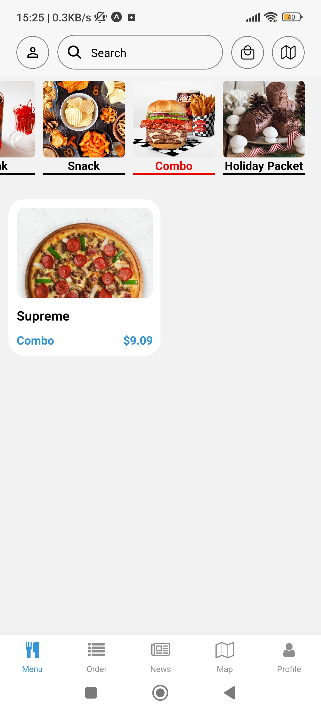
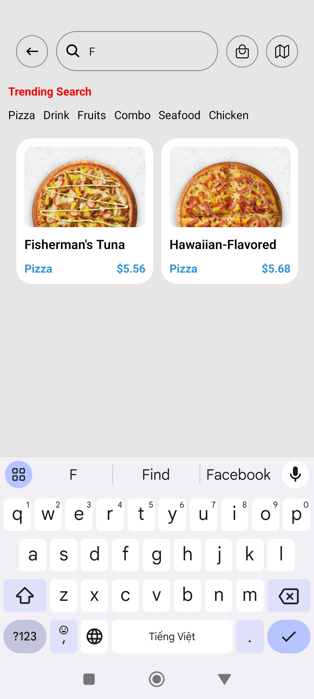
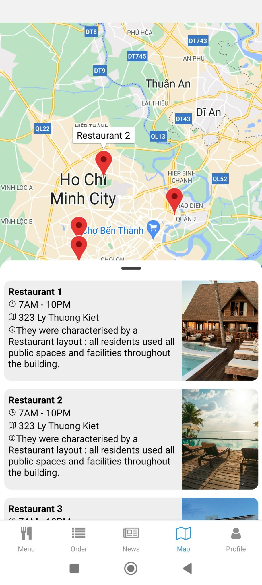
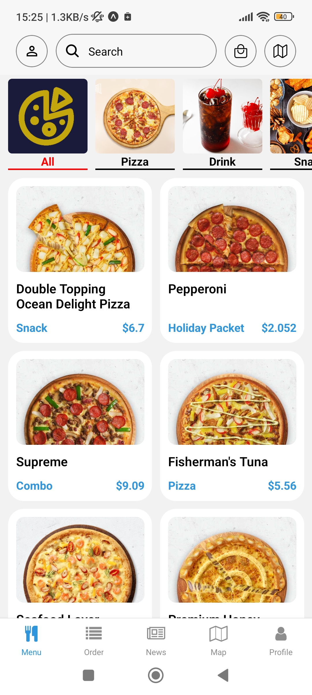

# PizzaMeal &middot;  [](https://www.npmjs.com/package/npm) [](https://github.com/vn-vietnam)


<!--  -->

## Screenshots

<details>
	<summary>View screenshots</summary>
<p align="left">
	<summary>Update</summary>
  
  
  
  
</p>
<p align="left">
  
  
  
</p>
</details>

## Demo


https://github.com/vn-vietnam/PizzaMeal/assets/119742667/37a491dd-d80b-4de0-b489-7348d41e12bf


https://github.com/vn-vietnam/PizzaMeal/assets/119742667/df889802-09b2-4801-bc55-4673a58eb0e0


https://github.com/vn-vietnam/PizzaMeal/assets/119742667/79af2115-9c5f-4f81-8368-ba95ae299401


https://github.com/vn-vietnam/PizzaMeal/assets/119742667/08f63109-8b92-4f33-b1b8-9159ee7d2ed4


https://github.com/vn-vietnam/PizzaMeal/assets/119742667/e7c61d1b-7822-4229-94c9-5ac75f072e1a


## Table of Contents

- [Introduction](#Introduction)
- [Features](#Features)
- [Technologies](#Technologies)
- [Testing](#Testing)
- [Installing](#Installing)
- [Prerequisites](#Prerequisites)
- [Setting up Dev](#Setting-up-Dev)

## Introduction

- PizzaMeal is a mobile app booking pizza online for customer convenient and fast.

## Features

- PizzaMeal have many features includes user/admin

  - <b>USER</b>
  - Login / Register user
  - Select type pizza, size and get product into cart and finally checkout
  - Update Information User
  - Check status pizza delivery

  - <b>ADMIN</b>
  - CRUD pizza
  - Manager / Update pizza delivery status

## Technologies

React Native - TypeScript - Expo - Supabase

## Testing

**user**

username: user@gmail.com
pass: 123456

**admin**

username: admin@gmail.com
pass: 123456

## Installing

A quick introduction of the minimal setup you need to get a hello world up &
running.

- Create file .env.example to file .env
- Register account [Supabase](https://supabase.com) add EXPO_PUBLIC_KEY to file .env

```shell
npm install
npm start
```

## Prerequisites

Please check file .env.sample

## Setting up Dev

Here's a brief intro about what a developer must do in order to start developing
the project further:

```shell
git clone https://github.com/vn-vietnam/PizzaMeal.git
cd PizzaMeal/
npm install
npm start
```
